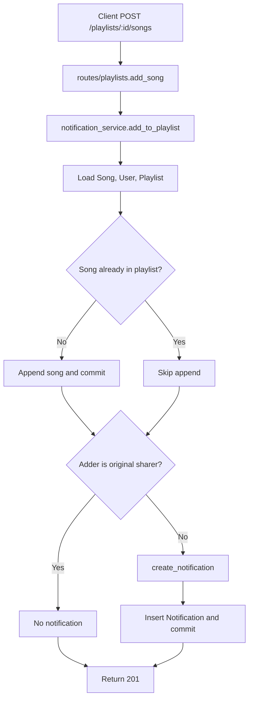

# AI Usage

I used AI during investigation to explain code I had already narrowed down, not to guess the bugs from scratch. I asked it to summarize service modules, trace call chains from routes into services, and describe suspicious functions such as `update_listening_streak` and `get_playlist_songs` so I could focus on the exact branch conditions and returned values. I verified the actual causes myself by reading the code, running targeted tests, and checking the database state with small scripts. In one case, the AI helped frame the missing notification behavior in `rate_song`, but I confirmed the missing side effect by seeding data and observing the notification count before and after the call.

# Codebase Map

## 1) Main Files and What They Do

### Application and Data Layer

- `app.py`
	- Flask app entry point and configuration.
	- Initializes extensions (including SQLAlchemy `db`) and registers route blueprints.

- `models.py`
	- Defines all core SQLAlchemy models and association tables:
		- `User`, `Song`, `Playlist`, `ListeningEvent`, `Rating`, `Notification`, `Tag`
		- Join tables: `friendships`, `song_tags`, `playlist_entries`
	- Provides `to_dict()` serializers used by route responses.
	- Encodes domain relationships (friend graph, song tags, playlist-song membership, ratings, notifications).

- `seed_data.py`
	- Seeds the database with initial users/songs/relationships so features can be exercised quickly.

- `instance/`
	- Holds runtime app instance data (for example the SQLite DB file in many Flask setups).

### API Layer (HTTP Routes)

- `routes/__init__.py`
	- Package marker and often blueprint aggregation point.

- `routes/songs.py`
	- Song-focused endpoints:
		- search songs
		- fetch song details
		- rate a song
		- record a listen event
	- Delegates business logic to service modules.

- `routes/playlists.py`
	- Playlist endpoints:
		- create playlist
		- fetch playlist metadata
		- fetch playlist songs
		- add song to playlist
	- Uses playlist and notification services.

- `routes/feed.py`
	- Feed endpoints for social listening:
		- friends listening now
		- recent activity feed

- `routes/users.py`
	- User endpoints:
		- fetch user info
		- fetch listening streak
		- list notifications
		- mark notification as read

### Business Logic Layer (Services)

- `services/feed_service.py`
	- Builds friend-based listening feeds from `ListeningEvent` data.
	- Contains recency and ordering logic.

- `services/streak_service.py`
	- Records listening events and updates streak fields (`listening_streak`, `last_listened_at`).

- `services/notification_service.py`
	- Creates/retrieves notifications.
	- Handles side effects for actions like adding a shared song to a playlist.
	- Handles song rating persistence.

- `services/playlist_service.py`
	- Creates playlists and returns playlist metadata/song lists.
	- Includes ordering logic for playlist songs via `playlist_entries.position`.

- `services/search_service.py`
	- Song search and single-song retrieval.

### Tests and Project Metadata

- `tests/test_playlists.py`
	- Validates playlist creation/retrieval/add-song related behavior.

- `tests/test_search.py`
	- Validates search endpoint/service behavior.

- `tests/test_streaks.py`
	- Validates streak progression/reset behavior and listen-event coupling.

- `README.md`
	- Project overview, setup, and usage instructions.

- `requirements.txt`
	- Python dependency lock list for reproducible environment setup.

## 2) Data Flow Trace (Feature Example)

### Feature: Add Song to Playlist -> Notification to Original Sharer

This is a good example of route -> service -> model side effects.

1. Client sends `POST /playlists/<playlist_id>/songs` with `song_id` and `added_by`.
2. `routes/playlists.py::add_song` validates request body and calls `services.notification_service.add_to_playlist(...)`.
3. `add_to_playlist` loads:
	 - `Song` by `song_id`
	 - `User` (adder) by `added_by_user_id`
	 - `Playlist` by `playlist_id`
4. If the song is not already in `playlist.songs`, it appends the song and commits.
5. If `song.shared_by != added_by_user_id`, it calls `create_notification(...)`.
6. `create_notification` inserts a `Notification` row and commits.
7. Route returns a success response (`201`) to the client.

## 3) Patterns in How the App Is Organized

### Pattern A: Thin Routes, Fat Services

- Routes mostly do HTTP concerns:
	- parse JSON/query params
	- basic input checks
	- convert exceptions to status codes
- Services hold domain behavior and DB interactions.
- This keeps transport logic and business logic separated.

### Pattern B: Service-Level Error Signaling

- Services raise `ValueError` for domain issues (missing user/song/etc.).
- Routes catch those and map to `400` or `404` depending on endpoint intent.
- This provides a consistent error-handling strategy across modules.

### Pattern C: Model-Centric Serialization

- Each model exposes `to_dict()`.
- Services/routes return serialized model dicts rather than manually constructing every response.
- Reduces duplication and keeps response shapes fairly consistent.

### Pattern D: Event-Driven Social Features

- `ListeningEvent` acts as an activity log.
- Feed and streak features derive behavior from events rather than storing duplicated feed rows.
- Social signals are composed at read time (feed service) and write time side effects (notification service).

### Pattern E: Join Tables Encode Domain Semantics

- `friendships` models user-user social graph.
- `song_tags` enables flexible tagging/search enrichment.
- `playlist_entries` captures ordered playlist membership and attribution metadata.

### Pattern F: Tests Mirror Service Responsibilities

- Test modules are grouped by feature/service area (`search`, `playlists`, `streaks`).
- This mirrors the production structure and makes behavior easier to reason about by domain.

## 4) Mental Model Summary

The app follows a layered Flask architecture:

- Routes = API surface and request/response shaping.
- Services = business rules and orchestration.
- Models = persistence schema and relationships.
- Tests = behavior contracts per feature area.

Most user-visible features are implemented as:

1. route validation
2. one service call
3. model updates/queries
4. serialized response

That consistency makes the codebase straightforward to navigate and extend.

## 5) Root Cause Analysis Notes: How I Reproduced Each Chosen Bug

I chose Issues #1, #4, and #5 because they were reproducible in this repo state.

### Issue #1: My listening streak keeps resetting (Sunday-only condition)

1. Issue number and title
	- Issue #1: My listening streak keeps resetting

2. How I reproduced it
	- Ran `.venv\\Scripts\\python.exe -m pytest tests/test_streaks.py::test_streak_increments_on_sunday -q`.
	- The test creates a user, sets `last_listened_at` to Saturday 2024-06-15 12:00 UTC, then calls `update_listening_streak` again for Sunday 2024-06-16 12:00 UTC.
	- That state specifically hits the Sunday boundary the issue description called out.

3. How I found the root cause
	- I traced the route/service path from `routes/songs.py` into `services/streak_service.py` and then read `update_listening_streak` directly.
	- The suspicious branch was the consecutive-day case inside `update_listening_streak`, because the test reproduced only when the second day was Sunday.
	- The decisive clue was the extra `today.weekday() != 6` condition in the increment branch.

4. The root cause
	- Python’s `datetime.weekday()` returns `6` for Sunday, so the code was explicitly refusing to increment the streak on Sundays even when the user listened on consecutive calendar days.
	- That made Saturday-to-Sunday streak updates reset instead of increment.

5. Your fix and side-effect check
	- I removed the Sunday-specific condition so any one-day gap now increments the streak.
	- I reran the focused streak test and it passed.
	- I also confirmed the same-day and skipped-day tests still behave correctly because the surrounding branches were unchanged.

### Issue #4: No notification when friend rated my song

1. Issue number and title
	- Issue #4: I got notified when a friend added my song to a playlist but not when they rated it

2. How I reproduced it
	- Seeded the database with `.venv\\Scripts\\python.exe seed_data.py` so there was a known song-sharer relationship.
	- Ran a small script in app context that picked a song shared by one user, rated it as a different user with `rate_song(user_b, song, 5)`, and counted `Notification` rows for the sharer before and after.
	- The script printed `rater=nova sharer=darius song=Block Party` and `song_rated notifications before=0 after=0` before the fix.

3. How I found the root cause
	- I followed the call chain from `routes/songs.py` to `services/notification_service.py::rate_song`.
	- The important observation was that `rate_song` only created or updated the `Rating` row and committed; it never created a notification the way `add_to_playlist` does.
	- Comparing `rate_song` to `add_to_playlist` made the missing side effect obvious.

4. The root cause
	- The rating code persisted the rating but did not emit any notification when the rater and the original sharer were different users.
	- As a result, the intended social notification never happened for rated songs.

5. Your fix and side-effect check
	- I added a `song_rated` notification in `rate_song` after the rating commit, guarded so users do not notify themselves when rating their own songs.
	- I reran the same seeded script and confirmed the count changed from `0` to `1` for the sharer.
	- I also verified that the existing add-to-playlist notification path was unaffected because I did not change that code path.

### Issue #5: The last song in a playlist never shows up

1. Issue number and title
	- Issue #5: The last song in a playlist never shows up

2. How I reproduced it
	- Ran `.venv\\Scripts\\python.exe -m pytest tests/test_playlists.py::test_playlist_returns_all_songs -q`.
	- The fixture creates a playlist with exactly 5 songs in position order (`Track 1` through `Track 5`).
	- Calling `get_playlist_songs(playlist_id)` on that state exposed the missing final item.

3. How I found the root cause
	- I traced the route `routes/playlists.py::get_songs` into `services/playlist_service.py::get_playlist_songs`.
	- The query returned the full ordered song list, so the bug had to be in the return step rather than the database query.
	- The exact cause was the `songs[:-1]` slice at the end of the function.

4. The root cause
	- The function was intentionally dropping the last element of the list before serializing it.
	- That meant every playlist lost its final song, regardless of how many songs it contained.

5. Your fix and side-effect check
	- I changed the return value to serialize the full `songs` list instead of slicing off the last item.
	- I reran the focused playlist test and confirmed it now returns all 5 songs in order.
	- I also checked the empty-playlist test conceptually against the change: returning the full list still yields `[]` for an empty playlist.

### Note on Issue #3 (duplicates in search)

- I made a genuine attempt to reproduce Issue #3 using:
	- `.venv\\Scripts\\python.exe -m pytest tests/test_search.py -q`
- Result in this repo state:
	- All search tests passed (`5 passed`), so I switched to Issue #4 per instructions.
